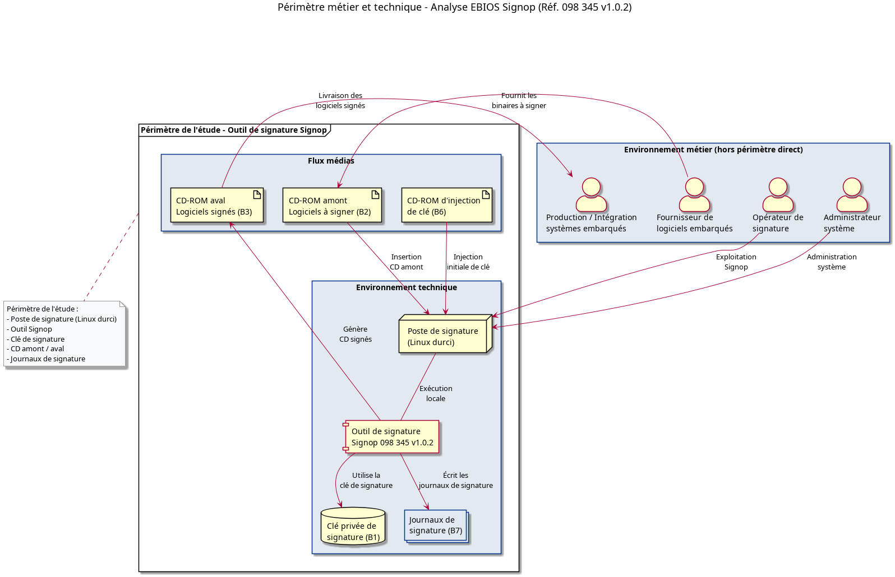

## Chapitre 1 – Contexte

### 1.1 Présentation de l’outil

Le produit **Signop Référence 098 345 – version 1.0.2** est un outil de **signature de logiciels embarqués**.  
Il fonctionne de la manière suivante :

- Des **logiciels de produits embarqués** sont fournis sur des **CD‑ROM amont**.
- Signop **vérifie et signe** ces logiciels en utilisant une **clé privée de signature**.
- Les logiciels signés sont ensuite **gravés sur des CD‑ROM aval** destinés à la production / au client.
- La **clé de signature** est injectée une seule fois, en phase de configuration, via un CD‑ROM dédié.

### 1.2 Périmètre de l’étude

**Inclus dans le périmètre**

- Le **poste de signature** :
  - Matériel du poste.
  - Système d’exploitation (Linux durci).
  - Application de signature **Signop** (binaire, configuration).
- Les **médias amont** :
  - CD‑ROM contenant les binaires sources à signer.
  - CD‑ROM d’injection de la clé de signature.
- Les **médias aval** :
  - CD‑ROM contenant les logiciels signés.
- La **clé privée de signature**, telle qu’elle est stockée et utilisée sur le poste.
- Les **journaux de signature** et la **traçabilité** associée.

_Figure 1 : représentation synthétique du périmètre technique et des flux médias (extrait du diagramme PlantUML)._ 

**Exclus du périmètre (mais impactés)**

- Le processus de **développement** des logiciels sources.
- Le **transport** et la **distribution** des médias amont et aval (au sens logistique global).
- Les services de **maintenance** hors opérations de signature.
- Les systèmes embarqués finaux qui consommeront les logiciels signés.

**Hypothèses de déploiement**

- Le poste Signop est **isolé**, non connecté à un réseau de production ou à Internet
  (hors éventuelles opérations de maintenance encadrées).
- L’outil refuse toute communication autre que via les médias amont/aval (CD‑ROM).
- Les opérateurs sont **formés** à l’utilisation de l’outil.
- Les médias amont et aval proviennent en principe d’un **tiers de confiance**, mais peuvent être
compromis (hypothèse de menace).

---

### 1.3 Valeurs métiers et services essentiels

Notation utilisée dans les tableaux :
- **C** = Confidentialité
- **I** = Intégrité
- **D** = Disponibilité
- **T** = Traçabilité
- **A** = Authenticité

#### 1.3.1 Valeurs métiers / services

| ID VM | Valeur métier / Service               | Description                                                                 | Criticité (1–4) | Besoins principaux |
|:-----:|--------------------------------------|-----------------------------------------------------------------------------|:---------------:|--------------------|
| VM1   | Authenticité des logiciels livrés    | Les logiciels embarqués livrés doivent être authentiques, non contrefaits. |        4        | I, A               |
| VM2   | Intégrité des logiciels signés       | Les binaires signés doivent rester strictement conformes aux versions validées. |     4        | I, A               |
| VM3   | Protection de la clé de signature    | La clé privée ne doit jamais être divulguée, copiée ou altérée.            |        4        | C, I, A            |
| VM4   | Disponibilité du processus de signature | La chaîne de signature doit être disponible pour ne pas bloquer la production. |     3        | D                  |
| VM5   | Traçabilité des opérations           | Il doit être possible de prouver qui a signé quoi, quand, avec quelle version. |    3        | T, I, A            |

#### 1.3.2 Biens supports essentiels

| ID Bien | Bien / Actif                     | Lié à VM              | Description                                         | Criticité (1–4) | Besoins principaux |
|:-------:|----------------------------------|-----------------------|-----------------------------------------------------|:---------------:|--------------------|
| B1      | Clé privée de signature          | VM1, VM2, VM3         | Secret de signature utilisé par Signop              |        4        | C, I, A            |
| B2      | Logiciels sources (CD amont)     | VM1, VM2              | Binaires à signer, fournis sur médias amont         |        3        | I, A               |
| B3      | Logiciels signés (CD aval)       | VM1, VM2              | Binaires finaux signés, destinés aux systèmes embarqués |     4        | I, A               |
| B4      | Poste de signature (matériel + OS) | VM2, VM4            | Poste Linux durci hébergeant Signop                 |        3        | D, I               |
| B5      | Logiciel Signop (binaire, config) | VM1, VM2, VM4        | Application de signature proprement dite            |        4        | I, D               |
| B6      | CD d’injection de clé            | VM3                   | Support physique injectant la clé privée            |        4        | C, I, A            |
| B7      | Journaux et traces de signature  | VM5                   | Preuves et traces des opérations                    |        3        | I, T, A            |
| B8      | Procédures / documentation       | VM5                   | Procédures d’exploitation et de contrôle            |        2        | I                  |

---

### 1.4 Attaquants / sources de risque

| ID  | Attaquant / Source                     | Description synthétique                                       | Motivation | Ressources | Activité | Pertinence |
|:---:|----------------------------------------|----------------------------------------------------------------|-----------|-----------:|---------:|-----------|
| A1  | Externe opportuniste                   | Attaquant non ciblé, profitant d’une faille ou d’un support compromis | ++        | ++        | ++       | Moyenne    |
| A2  | Externe ciblé (sophistiqué)           | Attaquant dédié (APT, concurrent malveillant…) visant la clé ou le process | +++       | +++       | +++      | Élevée     |
| A3  | Employé malveillant (insider)         | Opérateur ou personne interne détournant l’outil               | +         | +++       | +        | Faible à moyenne |
| A4  | Fournisseur du binaire / des médias   | Tiers fournissant les binaires ou les médias amont            | +         | ++        | +        | Faible à moyenne |
| A5  | Administrateur système malveillant     | Admin ayant des droits élevés sur le poste de signature       | ++        | +++       | ++       | Moyenne à élevée |

---

## Chapitre 2 – Événements redoutés

Échelle d’impact : **1 (faible) à 5 (catastrophique)**.

| ER ID | Actif impacté                     | Besoin compromis   | Description de l’événement redouté                        | Impact (1–5) |
|:-----:|-----------------------------------|--------------------|-----------------------------------------------------------|:------------:|
| ER1   | Clé privée (B1)                   | C                  | Divulgation ou copie de la clé de signature               |      5       |
| ER2   | Clé privée (B1)                   | I, A               | Altération, substitution ou usage non autorisé de la clé  |      5       |
| ER3   | Logiciel signé (B3)               | I, A               | Injection de code malveillant signé comme légitime        |      5       |
| ER4   | Journaux (B7)                     | I, T, A            | Altération ou effacement des journaux de signature        |      4       |
| ER5   | Poste / service de signature (B4,B5) | D                | Indisponibilité du poste ou du processus de signature     |      3       |
| ER6   | Logiciel source avant signature (B2) | I                | Altération du binaire avant signature                     |      4       |
| ER7   | Fonctionnement global (VM1–VM5)   | I, D               | Outil Signop inutilisable ou produisant des signatures incorrectes | 2 |

---

## Chapitre 3 – Scénarios de menace

Probabilité : **Légère (1), Moyenne (2), Haute (3)**.

| Scénario | Source     | Vulnérabilité clé / Condition            | ER ciblé         | Description du scénario                                                                 | Probabilité |
|:--------:|------------|------------------------------------------|------------------|-----------------------------------------------------------------------------------------|:-----------:|
| S1       | A3         | Clé accessible en clair sur disque / mémoire | ER1           | Un employé malveillant accède au fichier ou à la zone mémoire contenant la clé et en fait une copie. | Moyenne (2) |
| S2       | A2         | Absence de sécurisation forte de la clé  | ER1, ER2        | Un attaquant sophistiqué exploite une faiblesse technique (failles OS, maintenance, etc.) pour récupérer ou substituer la clé. | Légère à moyenne (1–2) |
| S3       | A3         | Absence de double contrôle / 4‑eyes      | ER2             | L’insider modifie la clé de signature ou injecte une autre clé sans contrôle croisé.   | Moyenne (2) |
| S4       | A4         | Absence de scan / hash des médias amont  | ER3, ER6        | Le fournisseur (ou la chaîne amont) fournit un CD contenant un binaire altéré ou malveillant, qui est signé tel quel. | Haute (3)   |
| S5       | A5         | Journaux non protégés / non externalisés | ER4             | L’administrateur modifie ou efface des logs pour masquer certaines opérations.          | Légère (1)  |
| S6       | A1, A2, A3 | Manque de redondance / sauvegarde        | ER5, ER7        | Panne matérielle, erreur de manipulation ou attaque entraînant la perte du poste Signop ou de sa configuration. | Moyenne (2) |

> Remarque : en pratique, S2 peut être noté à **2 (moyenne)** si l’on considère que l’attaquant ciblé est réellement crédible dans le contexte.

---

## Chapitre 4 – Risques (cotation)

Échelle :  
- Probabilité : **Légère (1) / Moyenne (2) / Haute (3)**  
- Impact : **1 à 5**  
- Score = Probabilité × Impact

| Scénario | Probabilité (1–3) | Impact max (ER) | Score | Niveau de risque |
|:--------:|:-----------------:|:---------------:|:-----:|------------------|
| S1       |         2         |        5        |  10   | Élevé            |
| S2       |         1         |        5        |   5   | Modéré           |
| S3       |         2         |        5        |  10   | Élevé            |
| S4       |         3         |        5        |  15   | Critique         |
| S5       |         1         |        4        |   4   | Modéré           |
| S6       |         2         |        3        |   6   | Modéré           |

### Matrice de risque

|               | Impact 1 | Impact 2 | Impact 3 | Impact 4 | Impact 5 |
|---------------|----------|----------|----------|----------|----------|
| Probabilité 1 |          |          |          | S5       | S2       |
| Probabilité 2 |          |          | S6       |          | S1, S3   |
| Probabilité 3 |          |          |          |          | S4       |

Les risques **prioritaires** sont donc :

- **S4** (critique) – Binaire malveillant fourni et signé.
- **S1** et **S3** (élevés) – Divulgation ou modification de la clé par un insider.
- Accessoirement, **S6** (modéré) – perte du poste ou de la configuration, et **S5** (modéré) – altération de la traçabilité.

---

## Chapitre 5 – Mesures de sécurité

Les mesures sont regroupées par risque principal, en distinguant **Prévention**, **Détection** et **Réaction / Résilience**.

### 5.1 Mesures prioritaires

| Risque (Scénario) | Objectif de sécurité                                  | Mesures de sécurité principales                                                                                           | Type                      |
|-------------------|-------------------------------------------------------|---------------------------------------------------------------------------------------------------------------------------|---------------------------|
| S4 – Binaire malveillant signé | Empêcher la signature de binaires non validés | - Mise en place d’un **processus de contrôle des médias amont** : scan antivirus, vérification de hash (SHA‑256) par rapport à une référence. - Acceptation uniquement de sources **sur liste blanche** (fournisseurs autorisés). - Procédure écrite de vérification avant signature (check‑list). | Prévention / Détection    |
| S1 – Fuite de clé par insider  | Protéger la confidentialité de la clé       | - Stockage de la clé dans un **HSM** ou module sécurisé dédié, jamais en clair sur disque. - Verrouillage des accès au poste (authentification forte, verrouillage automatique de session). | Prévention                |
| S3 – Modification de clé sans contrôle | Garantir l’intégrité et l’authenticité de la clé | - Procédure d’injection / remplacement de clé avec **double contrôle (4‑eyes)**. - Journalisation détaillée de toute opération sur la clé (qui, quand, comment). | Prévention / Détection    |
| S5 – Logs altérés                | Assurer la traçabilité fiable               | - Stockage des journaux sur un support **non modifiable** ou externalisé (serveur de logs, collecte régulière). - Signature ou hachage des fichiers de logs. | Prévention / Détection    |
| S6 – Perte du poste / service   | Assurer la disponibilité et la reprise      | - Sauvegardes périodiques de la configuration et des clés (dans des modules sécurisés). - Préparation d’un **poste de secours** pré‑configuré. | Résilience / Réaction     |

---